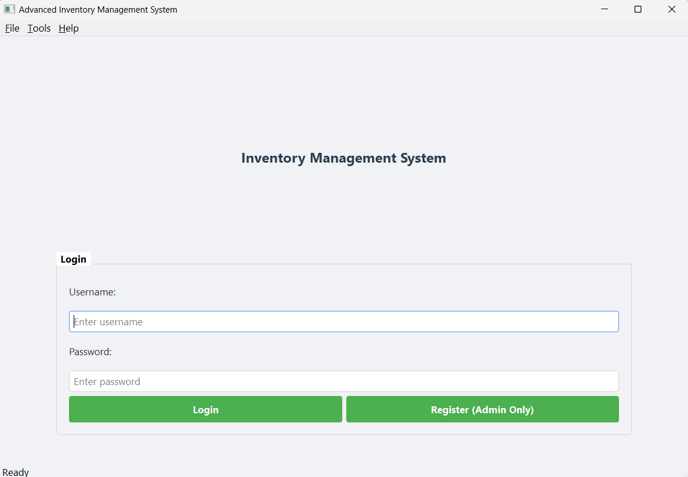

# 🚀 Advanced Inventory Management System

**Modern Python Inventory Solution for Businesses**  
*Track products, analyze sales, and manage stock like a pro!*

[](https://python.org)
[](https://pypi.org/project/PyQt5/)
[](LICENSE)

---

## 📋 Table of Contents

- [🌟 Why Choose This System?](#-why-choose-this-system)
- [🔥 Key Features](#-key-features)
- [👀 Visual Tour](#-visual-tour)
- [⚡ Quick Start Guide](#-quick-start-guide)
- [⚙️ Installation](#️-installation)
- [🧱 Project Structure](#-project-structure)
- [🛠️ Troubleshooting Tips](#️-troubleshooting-tips)
- [🤝 Contribution](#-contribution)
- [❓ FAQ](#-faq)
- [📜 License](#-license)
- [👏 Credits & Recognition](#-credits--recognition)
- [💬 Get in Touch](#-get-in-touch)

---

## 🌟 Why Choose This System?

This isn't just another inventory manager — it's a **complete business operations toolkit** built with Python and PyQt5. Designed for both small shops and growing enterprises, it transforms inventory chaos into crystal-clear control with:

- 📊 **Real-time analytics dashboards**
- 🔐 **Strong security**
- 📦 **Smart stock alerts**
- ✨ **Professional reporting**
- 📈 **Profit-optimizing insights**

---

## 🔥 Key Features

### 👥 User Management
- 🔐 Secure login with role-based access (Admin/Staff)
- 🆕 User registration with duplicate prevention
- 📝 Activity tracking for all critical actions

### 📦 Inventory Control
- ➕ Add/edit/delete products with validation
- 🚨 Smart low-stock alerts (color-coded warnings)
- 📋 Bulk operations for mass updates

### 💰 Sales Processing
- 🕒 Real-time inventory deduction during sales
- ❌ Over-sale prevention (can't sell what you don't have)
- 🧾 Transaction logging with timestamps

### 📊 Business Intelligence
- 📅 Daily sales revenue charts
- 🏆 Top product performance analytics
- 💵 Inventory valuation dashboards
- 📑 Export-ready reports (PDF/Excel/CSV)

### 🛠️ Professional Tools
- 📜 Full activity audit logs
- ↔️ Responsive pagination for large datasets
- 🔍 Instant search with live filtering
- 🖨️ Professional PDF exports with ReportLab

---

## 👀 Visual Tour

| Feature                   | Screenshot                                    | Highlights                                        |
|---------------------------|-----------------------------------------------|---------------------------------------------------|
| **Login Security**        |         | SHA-256 password hashing, role-based access       |
| **Admin Dashboard**       |   | Real-time stock alerts, color-coded warnings, instant search |
| **Sales Processing**      |  | Auto-calculated totals, stock validation          |
| **Business Analytics**    |  | Matplotlib charts, revenue trends, top products   |
| **Stock Alerts**          |  | Color-coded urgency levels (red/yellow)           |
| **PDF Reporting**         |       | Professional exports to PDF/Excel/CSV             |

> 💡 _Click on any screenshot for a closer look (if browsing on GitHub web)_

---

## ⚡ Quick Start Guide

1. **Clone the Repository**
    ```bash
    git clone https://github.com/sankalpsa/-Brainwave_Matrix_Intern.git
    cd -Brainwave_Matrix_Intern/Task\ 2
    ```
2. **Install Dependencies**
    ```bash
    pip install PyQt5 pandas matplotlib reportlab
    ```
3. **Launch the System**
    ```bash
    python "Inventory Management System"
    ```

4. **Login Using:**
    - Username: `admin`
    - Password: `admin123`
    - _(Change password after first login for security!)_

---

## ⚙️ Installation

### Prerequisites

- Python 3.7 or higher
- Libraries: PyQt5, pandas, matplotlib, reportlab

Install all dependencies with:

```bash
pip install PyQt5 pandas matplotlib reportlab
```

---

## 🧱 Project Structure

```
├── Inventory Management System  # Main application
├── inventory.db                 # Auto-generated database
├── screenshots/                 # Visual documentation
└── README.md                    # This documentation
```

---

## 🛠️ Troubleshooting Tips

| Issue                   | Solution                                      |
|-------------------------|-----------------------------------------------|
| Missing packages        | `pip install -r requirements.txt` or see above|
| Database errors         | Check directory write permissions             |
| GUI rendering issues    | Verify PyQt5 installation                     |
| Login failures          | Ensure database exists in execution directory |

---

## 🤝 Contribution

Contributions are welcome!  
If you have suggestions, bug reports, or want to add new features:

1. [Fork](https://github.com/sankalpsa/-Brainwave_Matrix_Intern/fork) this repo
2. Create your branch (`git checkout -b feature/your-feature`)
3. Commit your changes (`git commit -am 'Add new feature'`)
4. Push to the branch (`git push origin feature/your-feature`)
5. [Open a Pull Request](https://github.com/sankalpsa/-Brainwave_Matrix_Intern/pulls)

Please see the [CONTRIBUTING.md](CONTRIBUTING.md) if available.

---

## ❓ FAQ

**Q: How can I reset the admin password?**  
A: Delete the `inventory.db` file and restart the app (this will reset all data).

**Q: Can I use this for my business?**  
A: Yes! It's MIT licensed and free for commercial use.

**Q: Does it work on Windows/Mac/Linux?**  
A: Yes, as long as Python and the required libraries are installed.

---

## 📜 License

MIT License - Free for educational and commercial use with attribution.

---

## 👏 Credits & Recognition

Developed with ❤️ during the Brainwave Matrix Internship by [sankalpsa](https://github.com/sankalpsa)

---

## 💬 Get in Touch

- Found a bug? Have a feature request? [Open an Issue](https://github.com/sankalpsa/-Brainwave_Matrix_Intern/issues)
- Want to contribute? [Open a Pull Request!](https://github.com/sankalpsa/-Brainwave_Matrix_Intern/pulls)

---

## 🎬 Demo Video

[](https://youtu.be/YOUR_VIDEO_LINK)

> _Watch the video for a walkthrough of all features in action!_
